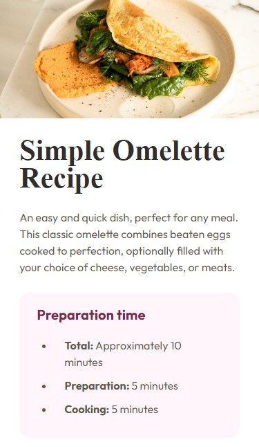

# Frontend Mentor - Recipe page solution

This is a solution to the
[Recipe page challenge on Frontend Mentor](https://www.frontendmentor.io/challenges/recipe-page-KiTsR8QQKm).
Frontend Mentor challenges help you improve your coding skills by building
realistic projects.

## Table of contents

- [Overview](#overview)
  - [Screenshot](#screenshot)
  - [Links](#links)
- [My process](#my-process)
  - [Built with](#built-with)
- [Author](#author)

## Overview

### Screenshot

### Links

- Solution URL:
  [Frontend Mentor solution Page](https://www.frontendmentor.io/solutions/simple-recipe-page-using-css-flexbox-_0GkUdU_m0)
- Live Site URL:
  [Hosted on Github pages](https://stanmancer.github.io/recipe-page/)

## My process

### Built with

- Semantic HTML5 markup
- CSS custom properties
- Flexbox
- Mobile-first workflow

## Author

- Website - [Stanmancer](https://limey.io/stanmancer)
- Frontend Mentor -
  [@stanmancer](https://www.frontendmentor.io/profile/stanmancer)
